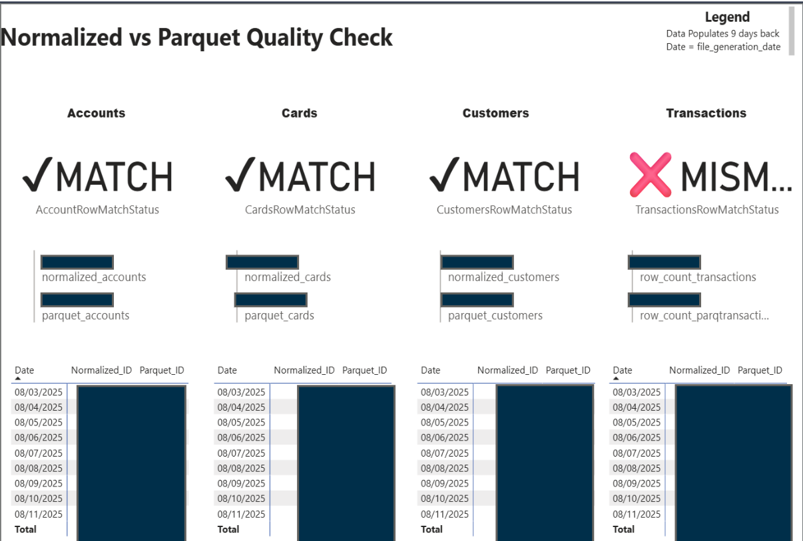
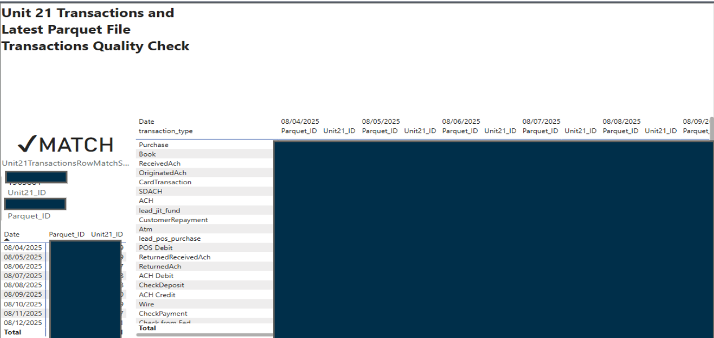
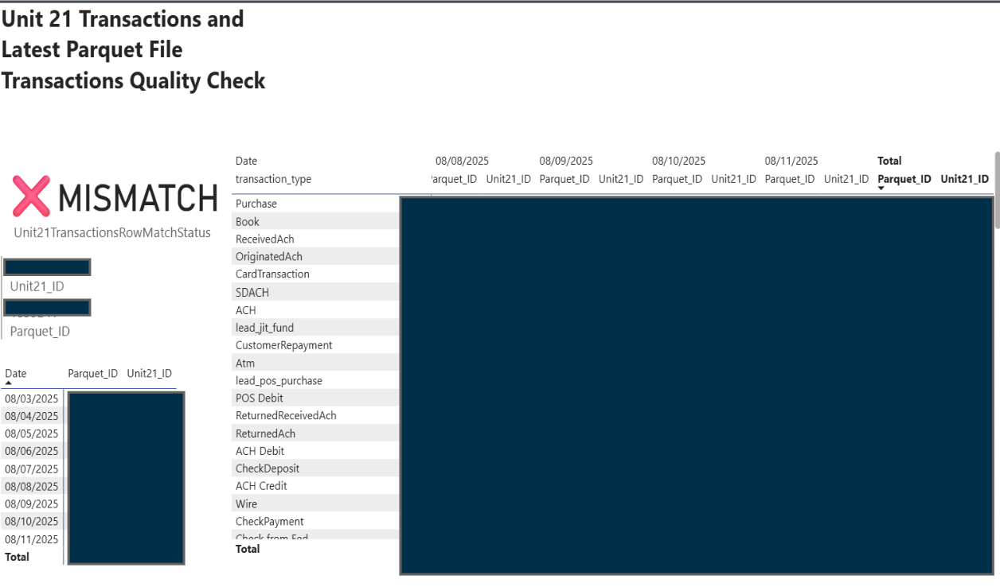
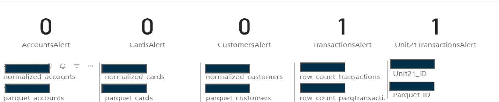
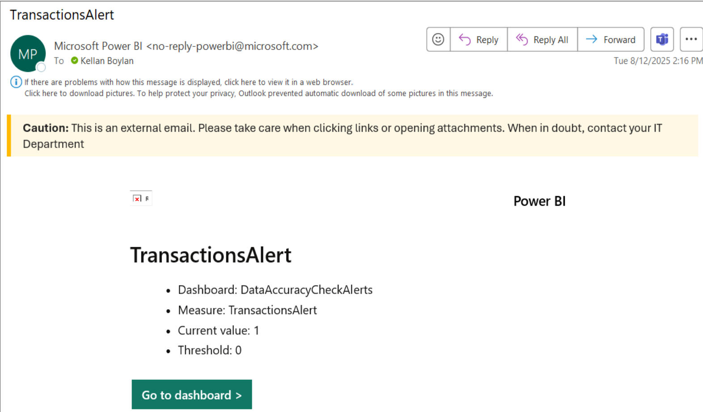
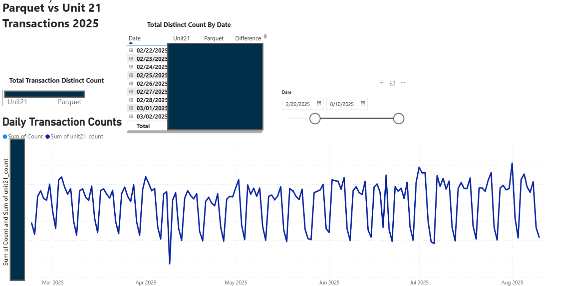
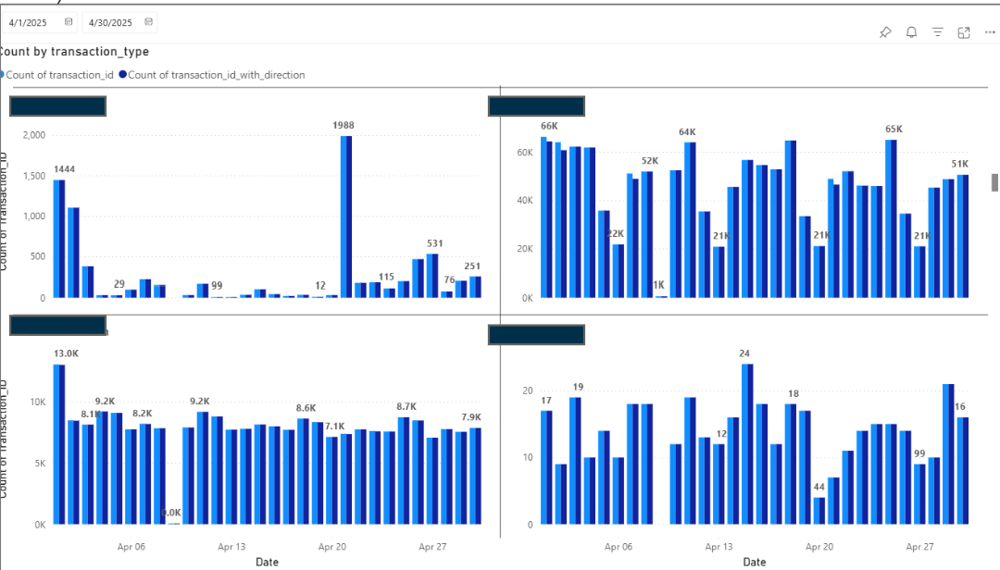
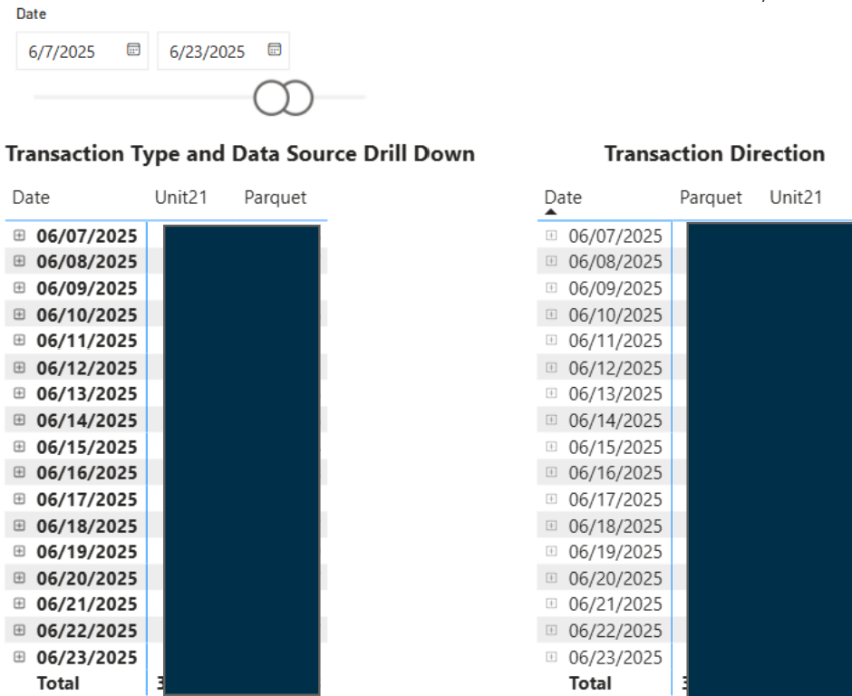
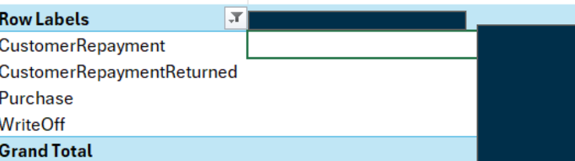
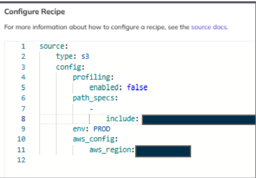

# Fintech Data Quality Monitoring System

I built this during my data analytics internship at Thread Bank. The goal was to help the product/data team catch data mismatches faster, understand where issues were coming from, and reduce manual review across recurring reporting checks.

This is a sanitized portfolio version. Private data, identifiers, and sensitive fields have been removed or blocked out.

---

## What I Built

- Power BI dashboards for short-term and long-term data quality checks
- SQL-based data pulls and validation logic to compare reporting outputs
- Match/mismatch checks across normalized files, parquet files, Unit21 data, and vendor-related outputs
- Drilldowns by date, transaction type, data source, and transaction direction
- Automated Power BI alerts when a quality check failed
- Excel pivot-table workflow to investigate problem dates and record-level differences
- DataHub ingestion recipes and schema/freshness assertions for pipeline monitoring
- Jira documentation to track work, communicate progress, and leave a clear process trail for stakeholders

---

## Why It Mattered

In a fintech environment, bad data can move quickly through reporting channels. This project gave the product team a clearer way to see whether important data sources matched, where they did not match, and what needed to be investigated.

**Impact:**

- Detected 3 data issues within the first week, including 1 higher-severity issue
- Helped the product team monitor reporting risk across recurring checks
- Reduced manual review by turning file comparisons into dashboards and alerts
- Built 7+ DataHub ingestion recipes to improve visibility into data assets and pipeline health
- Documented work in Jira so stakeholders could follow progress, understand decisions, and look back on the process after handoff
- Created reporting outputs that remained useful after the internship

---

## Project Flow

### 1. Quick Quality Check

The dashboard gave the team a fast match/mismatch view across accounts, cards, customers, and transactions.

When a mismatch appeared, the team could immediately see which category needed attention.

---

### 2. Unit21 vs Parquet Transaction Checks

I built checks comparing Unit21 transaction output against the latest parquet files. The dashboard showed both clean matches and mismatch states, then allowed drilldown by date and transaction type.

---

### 3. Automated Alerts

I set up alert logic so the team could be notified when a check failed instead of manually reviewing everything each day.

---

### 4. Long-Term Monitoring

The long-term views helped show transaction volume patterns over time instead of only checking one day at a time.

The dashboard also broke down activity by transaction type, source, direction, and date range so the team could narrow down issues faster.

---

### 5. Issue Investigation

Once the dashboard showed a problem date, I queried and reviewed the underlying data, then used Excel pivot tables to isolate details that could help the team troubleshoot.

---

### 6. DataHub Recipes and Assertions

Beyond the dashboards, I created DataHub ingestion recipes and schema/freshness assertions to help monitor pipeline health and data asset reliability.

---

## Tools Used

| Area | Tools |
|---|---|
| Dashboards | Power BI |
| Querying and validation | SQL |
| Data modeling/checks | Power Query, DAX |
| Investigation | Excel pivot tables |
| Data governance | DataHub |
| Alerting | Power BI alerts and email notifications |
| Project tracking | Jira |
| Data quality focus | Row-level comparisons, schema checks, freshness checks |

---

## What This Shows

This project shows that I can:

- Query data and validate results across multiple sources
- Build dashboards that support real business decisions, not just visuals
- Turn recurring data-quality checks into a usable monitoring workflow
- Create automated alerts to catch issues earlier
- Document technical work clearly in Jira for stakeholder visibility and handoff
- Work carefully with confidential financial-services data
- Explain technical issues clearly to stakeholders
- Support both analytics and data governance work

